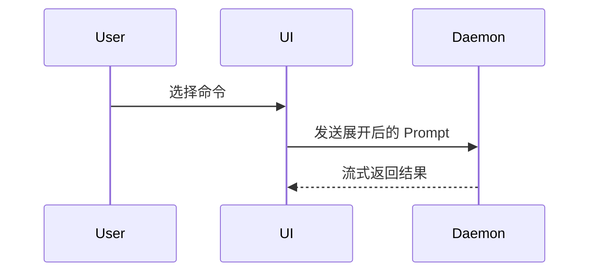

# 结构化 PR 描述

撰写符合高工业标准的 Pull Request 描述，帮助评审者快速理解改动全貌、核实运行证据并评估合并风险。

跳过所有客套前言，保持语言精炼。使用项目 `CONTEXT.md` 中的通用语言与领域术语。

## PR 描述模板

撰写 PR 正文时，统一使用以下结构化模板：

```markdown
## Summary

<伪代码、调用树、组件树、文件树或差异草图>

## Evidence

- **Before:** <修改前症状、截图或失败测试运行证据>
- **After:** <修改后表现、截图或通过测试运行证据>

## Merge Danger

- **Door:** <one-way 或 two-way，及判定理由>
- **Blast Radius:** <合并的潜在影响面与风险评估>
```

## 三大核心模块

### 1. 摘要（Summary）

挑选能够清晰阐述核心焦点的**最小化直观视图**，避免堆砌无用细节。根据变更类型选择最合适的呈现形式：

- **算法或业务逻辑**：使用伪代码展示关键判定分支与计算逻辑：

```text
on(save)
  if content is unchanged
    return cached result
  write new content
  return fresh result
```

- **运行时控制流**：使用缩进调用树展示关键调用时序与执行链路：

```text
submitForm
  createSession
    persistPrompt
    launchAgent
  navigateToSession
```

- **界面与 UI 结构**：使用组件树展示组件层级、关键状态及模块边界：

```tsx
<SessionPage> (apps/example/src/routes/session.tsx)
  useSessionEvents()
  <SessionToolbar>
    <RunSkillButton> (packages/ui)
```

- **模块职责或大型重构**：使用浅层文件树展示目录分工与文件归属：

```text
src/
├── commands/       # 解析用户操作
├── sessions/       # 管理会话状态
└── transport/      # 发送 API 请求
```

- **组件交互、状态转移或数据流**：使用 Mermaid 序列图或流程图可视化：



- **局部结构微调**：使用局部 diff 草图展示修改前后的差异焦点。根据讨论主题匹配 diff 形式：

组件变更 diff：

```diff
 <SessionPage>
   useSessionEvents()
   <SessionToolbar>
+    <RunSkillButton />
   <SessionTimeline>
+    <SkillResultCard />
```

文件布局变更 diff：

```diff
 src/
 ├── commands/
+│   └── show-me.ts       # 展开斜杠命令
 ├── sessions/
-└── transport.ts
+└── transport/
+    ├── client.ts
+    └── stream.ts
```

调用树变更 diff：

```diff
 submitForm
   createSession
     persistPrompt
+    expandSkillMention
     launchAgent
-  navigateToSession
+  navigateToSession
+    subscribeToEvents
```

状态流或控制流变更 diff：

```diff
 on(save)
-  write content
+  if content is unchanged
+    return cached result
+  write new content
+  invalidate cache
```

- **全新模块或目标形态**：大部分代码为新建、省略上下文会掩盖归属顺序，或需要向用户提供可复制的目标形态时，展示完整代码块：

```ts
function expandSkill(command: string): string {
  const skillName = command.slice(1);
  return `use the ${skillName} skill`;
}
```

#### 视觉呈现原则

- 视觉图表与紧凑的解释文字并列排布。
- 只保留回答当前关键疑问、解决讨论分歧所必需的调用、文件、属性、状态与边界。
- 视场景组合使用上述一种或多种表达形式，避免堆砌过多视图给评审者造成认知负担。

### 2. 证据（Evidence）

提供改动生效的真实证据，明确展示修改前（Before）与修改后（After）的鲜明对比。

遵循 `verifying-completion` 的**先证据后结论**原则：所有证据必须基于本轮重新完整运行的真实输出，严禁依赖口头断言或过往运行记忆。

- **S 级证据（界面交互）**：如果涉及视觉界面或交互改动，且环境支持截图，优先提供操作截图或动图对照。
- **A 级证据（执行检验）**：基于可执行测试套件或控制台命令的输出。必须呈现修改前确切失败、修改后确切通过的测试信息（可用伪代码或关键测试输出片段表达）：
  - **Before**：复现缺陷的测试失败日志、报错堆栈或未生效前的行为。
  - **After**：最新运行的完整测试套件输出（例如 `npm test`：全部通过，0 失败）、端到端验证输出或符合预期的接口响应。

### 3. 合并风险（Merge Danger）

评估 PR 合并后对生产环境和上下游系统的潜在风险，为合并决策提供依据。

#### 决策门属性（Door）

明确标识变更是**单向门（one-way door）**还是**双向门（two-way door）**：

- **双向门（Two-way Door）**：容易撤销且回滚成本低的改动。例如常规内部实现重构、新增未被引用的非核心功能、文档与注释优化等。
- **单向门（One-way Door）**：涉及破坏性操作、不可逆数据变更、对外破坏性兼容改动（Breaking Change）或难以撤销的架构决策。此类变更需要极高的审查审慎度与前置应急方案。

#### 爆炸半径（Blast Radius）

评估如果该 PR 存在缺陷或发生异常，可能影响的最大范围和波及面：

- 考虑所有潜在后果：下游调用方是否可能中断、界面布局是否发生意外偏移、移动端或多端兼容性、数据库负载与性能影响、权限与安全边界等。
- 对高风险或单向门改动，必须附带回滚步骤或故障应急预案。
